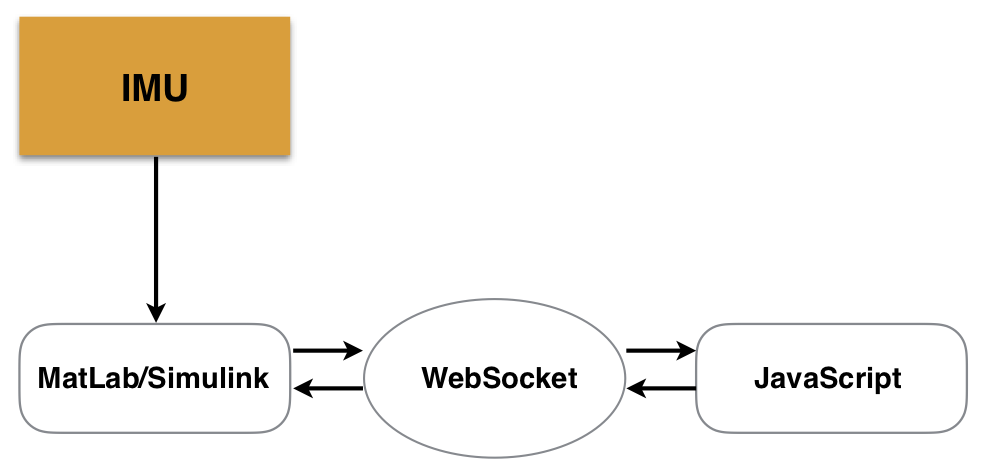
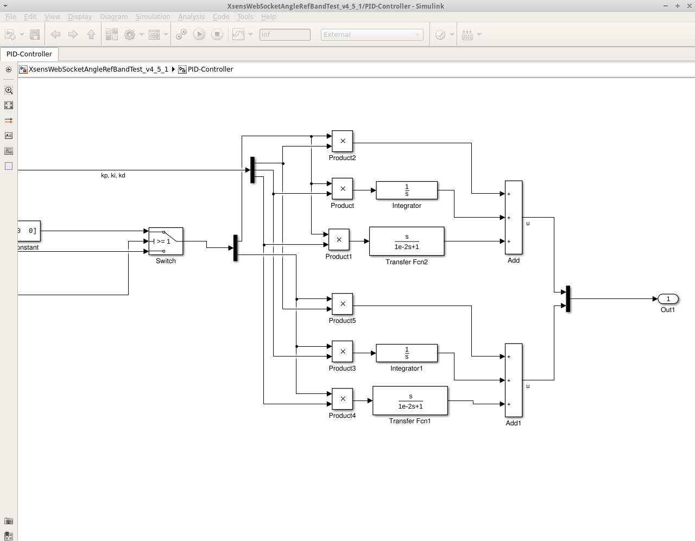
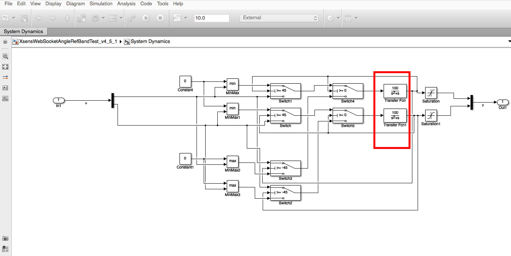
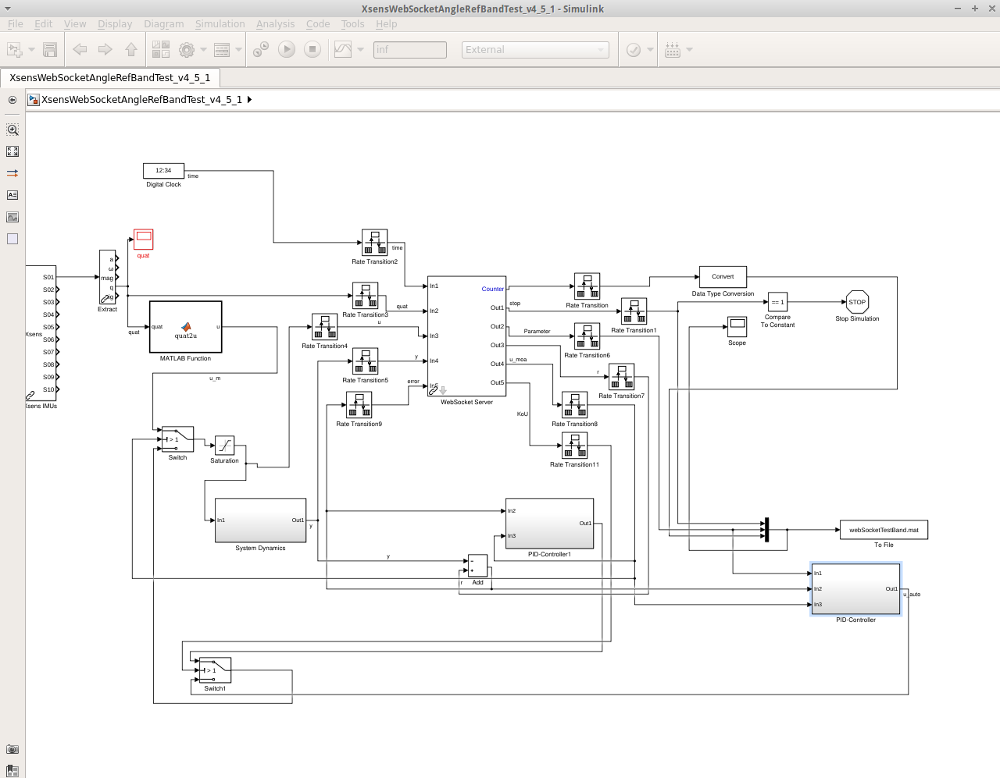
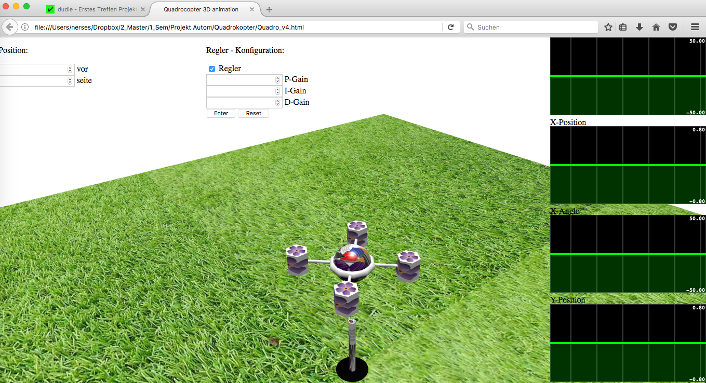

# Simulation of Quadcopter

Today the PID concept is used universally in applications requiring accurate and optimized automatic control. 
This project aims to design a 3D simulation to illustrate the behavior of various control loop mechanisms 
(proportional (P) or/and integral (I) or/and derivative (D) controller) with freely selectable parameters. 
The simulation also allows the user to control a virtual quadcopter with a wireless IMU (inertial measurement unit) 
as a joystick and to move the quadcopter to a desired reference. The simulation should also allow the user to test 
the performance of the desired controller (e.g. PID) for the virtual quadcopter.

For the visualization of the simulation, a `3D animation` is created in `JavaScript` using the library `Babylon.js`. 
The whole thing is placed on the browser - `HTML5` is used for this. Besides, a controller and a line dynamic is also 
used for the automated movement of the quadcopter. This is realized in `Matlab/Simulink`. From `Matlab`, the manipulated 
variable and the output of the line dynamics are transferred to `JavaScript`. Also, the user should be able to enter data 
(such as B. the reference, parameters of the `PID controller`, etc. ) on the user interface, which is then fed back to 
`MatLab/Simulink`. The corresponding block diagram of the project is shown in Figure 1. 

The interface between `MatLab` and `HTML` is realized with the `WebSocket` protocol because it has the property to maintain 
an open connection while the user actively uses this open connection without asking the server for the answer. 
This guarantees a real-time simulation. Since, as mentioned above, you also want to drive the quadcopter yourself in the 
simulation, an inertial measurement unit (IMU) is used. The `Xsens MTw Awinda` sensor is used as `IMU`, which sends the acquired 
data to a receiver via Bluetooth, whereby the receiver (dongle) is connected to the PC. The data arrives in MatLab `$ quatmul.m` as a quaternion vector and is stored therein parameters necessary for us (e. g. B. Inclination forward/backward and left/right).

The development of the quadcopter and the whole environment of the animation in `HTML` and `JavaScript` can be found in file `$ indexWebSocket_v9_3_with_timer.html` . there is also the `Javascript` code that opens a `Websocket` and runs the simulation. As you can see, it also contains the library `$ Babylon.js`, which is needed for the 3D representation of the quadcopter. As soon as the quadcopter is close enough to the reference position, the time is stopped. If you enter it for a short time, but then leave it again, the time that has continued in the meantime is displayed. In addition, four real-time plots for the x and y direction are displayed in the user interface, each for the manipulated variable and the reference. This is to illustrate the performance of the controller or manual operation. 

To ensure that user input is also required in the simulation, the function was also implemented in the `$ indexWebSocket_v9_3_with_timer.html` file. In addition to the desired input of the reference and the parameters of the `PID controller`, the user can also select a 1D movement and a fixed controller K(s) via a transfer function in `Simulink`. The 1D movement allows the forward/backward movement to be completely eliminated, so that the quadcopter is only controlled right/left. If the controller selection is not selected, the quadcopter is only moved manually with the `IMU`. The demo also has the feature that a stopwatch is used if, for example, you want to compete against the set controller.

### Controller principle and system dynamics 

To allow a variable selection of the controller (e. g. B. P- , PI-, PD- and PID-controllers) it is recommended to create the transfer functions individually (see figure 2). A continuous system was chosen for the I and D component. As you can also see, each system is present in duplicate. The reason is that the quadcopter is to be controlled in both x and y-direction. The output is again a vector, which is output as controlled variable y. As input, the controller receives both the parameters entered by the user and the control deviation. A switch is also built-in, which prevents the controller from further integration even when the manual mode is switched on. The individual controller components are then added together and output as a vector. This output is the manipulated variable. 

A continuous system was also chosen for the system dynamics. This is shown in red in Figure 3. And also for the reason that the quadcopter should be moved in both x- and y-direction, the double execution of the system dynamics. As input, it receives the manipulated variable, which can come from the IMU as well as from the controller. The other blocks shown in figure 3 are responsible for limiting the running surface of the quadcopter. The Saturation block ensures that the transfer function is followed by a limitation.

### Integration with Simulink 

Simulink is used to perform the corresponding calculations of the movements of the quadcopter. Necessary blocks must be implemented in it to give a practical effect on the simulation. This is shown in Figure 4. As you can see, in Simulink the data is directly acquired from the IMU and converted with a MatLab function. The result of the conversion, as already mentioned, is the inclination of the IMU right/left and front/rear. Simulink also defines the WebSocket. It receives as input the controlled variable (y), the manipulated variable (u), the control deviation (error) and a time. The most important output from the web socket is only the user's input on the user interface. These are namely the parameters of the PID controller (Parameter), the reference (r), the input whether the controller (automatic) or the manual operation of the quadcopter should be used and whether a fixed defined controller K(s) should be used. For a harmonious interaction of the different components (e. g. B. automatic or manual) switches are used. These switches work with simple numbers that are output by the WebSocket, but on the user interface, this is only a simple checkmark. A 0 is output as soon as the controller is selected and the output of the PID controller is forwarded in the switch. Otherwise, a 5 is output and the user can operate the quadcopter manually. Switch1 works analogously.

